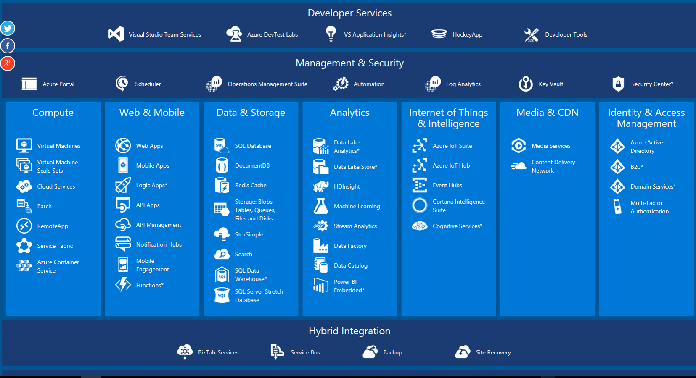
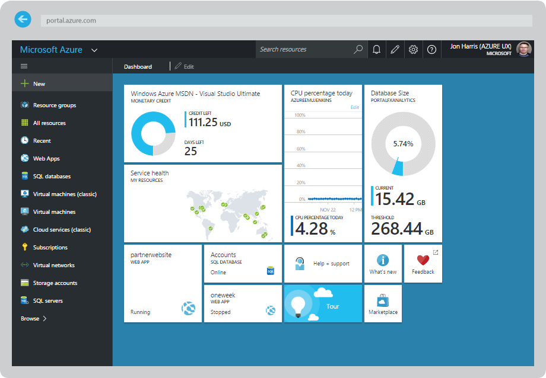
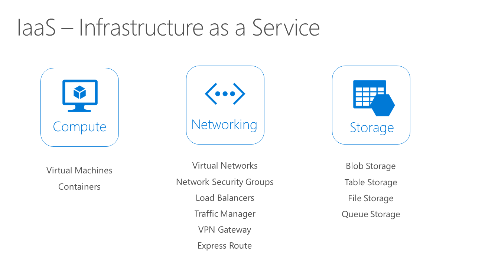

# Azure Quickstart
Resources to get started quickly on Microsoft's cloud platform.

## Getting Started
- [Interactive Azure Map](https://aka.ms/azmap) - Explore this interactive overview of services available on the Azure platform, grouped by type. Click on service names to learn about them and get links to get started.
- [Azure Learning Paths](https://azure.microsoft.com/en-us/documentation/learning-paths/) - Get started with these learning paths for different Azure Services.
- [Azure on Microsoft Virtual Academy](https://mva.microsoft.com/training-topics/cloud-app-development) - Virtual courses on cloud development.
- [Azure on Channel9](https://channel9.msdn.com/Azure) - Video tutorials about Azure services.

## Working with Azure
- [Azure Portal](https://portal.azure.com) - The best way to get started is with the Azure portal, a web based interface for managing Azure.
- [Azure SDKs & Tools](https://azure.microsoft.com/en-us/downloads/) - SDKs for many common languages such as .NET, Java, Node.js, Python, Ruby and other tools.
- [Azure PowerShell](https://msdn.microsoft.com/en-us/library/jj156055.aspx) - Work with PowerShell cmdlets to perform Azure operations.
- [Azure CLI](https://azure.microsoft.com/en-us/documentation/articles/xplat-cli-install/) - For Linux, Mac or Windows. Installs via npm package manager.
- [Azure API Reference](https://msdn.microsoft.com/en-us/library/azure/mt420159.aspx) - Reference for Azure REST and .NET APIs.
- [Azure Resource Explorer](http://resources.azure.com/) - A very useful web application to explore the Azure REST API.
- [Azure Storage Explorer](http://storageexplorer.com/) - A client application for Linux, Mac or Windows to easily work with storage accounts on Azure. 

## Azure Resource Manager (ARM)
The Azure Resource Manager is at the core of the Azure platform and is used to deploy and manage Azure services. Every resource in Azure managed under ARM can be described and managed in a consistent way. It's very helpful to understand the Azure Resource Manager and how to work with Resource Groups.
> Azure has two different deployment models for creating and working with resources: Resource Manager and classic. Microsoft recommends that most new deployments use the Resource Manager model. 

- [ARM Overview](https://azure.microsoft.com/en-us/documentation/articles/resource-group-overview/) - Get an overview of the Azure Resource Manager
- [ARM vs. Classic](https://azure.microsoft.com/en-us/documentation/articles/resource-manager-deployment-model/) - Understand the difference between ARM the Classic (ASM) deployment model.

### ARM Templates
ARM templates are JSON descriptions of ARM deployments which can be used for "Infrastructure as Code".
- [Deploying ARM Templates](https://azure.microsoft.com/en-us/documentation/articles/resource-group-template-deploy/) - With PowerShell, Azure CLI or REST API.
- [Quick Start Templates](https://github.com/Azure/azure-quickstart-templates) - A Github maintained, vast collection of templates for common use cases to help you get started authoring your own templates or deploying simple solutions.
- [Template Authoring](https://azure.microsoft.com/en-us/documentation/articles/resource-group-authoring-templates/) - How to author custom templates.

## Infrastructure Services
Infrastructure as a service (IaaS) refers to the compute, networking and storage building blocks which allow you to build any kind of cloud solution. IaaS allows you to have maximum control on how you manage virtual machines, network configuration but requires you to invest in attaining robustness, availability and scalability in the cloud.  

### Compute
- [Virtual Machines Learning Path](https://azure.microsoft.com/en-us/documentation/learning-paths/virtual-machines/) - Learn about VMs. How to deploy and manage via the portal, PowerShell, ARM templates etc.
- [Linux VM](https://azure.microsoft.com/en-us/documentation/articles/virtual-machines-linux-quick-create-portal/) - Get started with creating a Linux VM using the Azure portal.
- [Windows VM](https://azure.microsoft.com/en-us/documentation/articles/virtual-machines-windows-hero-tutorial/) -  Get started with creating a Windows VM using the Azure portal.
- [VM Extensions](https://azure.microsoft.com/en-us/documentation/articles/virtual-machines-windows-extensions-features/) - Learn about extension to virtual machines such as the Chef, Docker or custom script extensions.
- [Learn about VM Availability](https://azure.microsoft.com/en-us/documentation/articles/virtual-machines-linux-manage-availability/) - Use best practices and learn about VM availability sets.
- [VM Scale Sets Overview](https://azure.microsoft.com/en-us/documentation/articles/virtual-machine-scale-sets-overview/) - Learn about deploying and managing VM scale sets.
- [Choosing between App Services, Service Fabric and VMs](https://azure.microsoft.com/en-us/documentation/articles/choose-web-site-cloud-service-vm/) - including scenarios and recommendations.

### Networking
- [Virtual Networks (VNets) Overview](https://azure.microsoft.com/en-us/documentation/articles/virtual-networks-overview/)
- [Network Security Groups](https://azure.microsoft.com/en-us/documentation/articles/virtual-networks-nsg/)
- [Load-balancers](https://azure.microsoft.com/en-us/documentation/articles/load-balancer-overview/)

### Storage
- [Azure Storage Overview](https://azure.microsoft.com/en-us/documentation/articles/storage-introduction/) - High level overview of storage accounts, blobs, tables and queues.

## Platform Services
Platform as a Service (PaaS) resources are Azure services which are built for most cases and allow you to enjoy high availability, scalability and robustness out of the box. Instead of managing VMs directly, let Azure manage the underlying infrastructure and focus on building your applications and solutions. 
### Azure App Service
- [Azure App Service Overview](https://azure.microsoft.com/en-us/documentation/articles/app-service-value-prop-what-is/) - Learn about Web Apps, Mobile Apps, API apps.
- [Continuous Delivery with Azure App Service](https://azure.microsoft.com/en-us/documentation/articles/web-sites-publish-source-control/) - Publish web apps via a simple git push.
- [Azure Function Apps](https://azure.microsoft.com/en-us/documentation/articles/functions-overview/) - Learn about running simple code functions in the cloud.

### Azure SQL
- [Azure SQL Overview](https://azure.microsoft.com/en-gb/documentation/articles/sql-database-technical-overview/) - Get started with Azure SQL.
- [Azure SQL vs. SQL on VMs](https://azure.microsoft.com/en-us/documentation/articles/data-management-azure-sql-database-and-sql-server-iaas/) - Learn what scenarios are better for an IaaS vs. PaaS SQL solution.

### DocumentDB
- [DocumentDB Overview](https://azure.microsoft.com/en-us/documentation/articles/documentdb-introduction/) - Learn about DocumentDB, a managed NoSQL JSON database.
- [MongoDB Support](https://azure.microsoft.com/en-us/documentation/articles/documentdb-protocol-mongodb/) - Learn about DocumentDB compatibility with mongoDB clients.

### Many, Many more PaaS solutions...
- [Explore additional Azure managed solutions](https://azure.microsoft.com/en-us/documentation/learning-paths/)

## Azure Marketplace
The Azure Marketplace is a huge (+3K) repository of "off the shelf" 3rd party solutions available for quick deployment in the cloud. Some solutions are free, others are "pay-as-you-go" and others are "bring your own license". Many open source solutions are available as well.
- [Browse Marketplace Solutions](https://azure.microsoft.com/en-us/marketplace/https://azure.microsoft.com/en-us/marketplace/)

## Cloud Architecture
- [Cloud Patterns & Practices](https://aka.ms/mspnp) - Best practices for building cloud solutions. Including checklists and design patterns. 
- [Architecture Blueprints](https://msdn.microsoft.com/architects-blueprints-msdn) - Architectures for an array of different cloud scenarios.

## Additional Useful Tools & Links
- [Azure Services Status](https://azure.microsoft.com/en-us/status/) - Realtime status of service availability across all Azure regions.
- [Azure Price Calculator]( https://aka.ms/azurecalc) - Easily calculate pricing of Azure Services
- [Azure Trust Center](https://azure.microsoft.com/en-us/support/trust-center/) - Learn about Azure security, compliance, privacy and transparency. 
- [Azure Subscription Service Limits](https://azure.microsoft.com/en-us/documentation/articles/azure-subscription-service-limits/) - Learn about Azure subscription and service limits, quotas, and constraints.
- [AWS/Azure mapping](https://azure.microsoft.com/en-us/campaigns/azure-vs-aws/mapping/) - Map between Azure and AWS services.